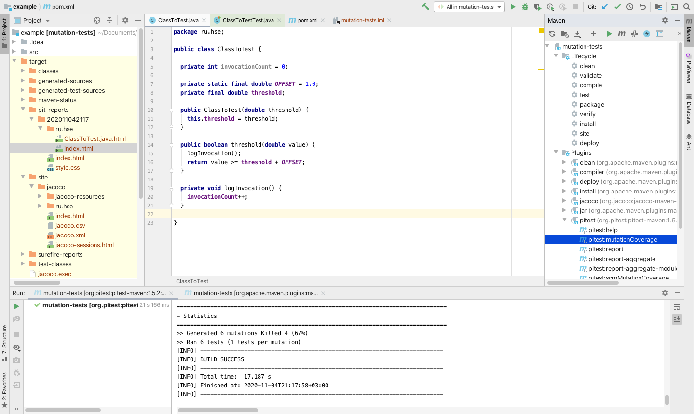

Семинар 7
--

# Мутации исходного кода.

### Слайды

* [PDF](Seminar07.pdf)
* [PPTX](Seminar07.pptx)

### Видео

* [Видео](https://yadi.sk/i/kJUPHuv6cn0Y9Q).

### Пример

Java-проект со скриптом сборки для Maven,
который демонстрирует использование [Pitest](https://pitest.org) для мутационного тестирования,
находится [здесь](https://github.com/andrewt0301/qa-testing-course/blob/master/seminars/seminar07/example).
В проекте используются тесты на [JUnit 5](https://junit.org/junit5/).
Настроено измерение тестового покрытия при помощи [JaCoCo](https://www.eclemma.org/jacoco/).

Для запуска мутационного тестирования нужно запустить следующие задания Maven-а:

1. _compile_ - скомпилировать код;
1. _test_ - скомпилировать тесты;
1. _pitest:mutationCoverage_ - запустить Pitest.

Отчет о тестировании Pitest (в формате HTML) будет в папке `example/target/pit-reports`.
Отчет о покрытии JaCoCo (в формате HTML) будет в папке `example/target/site/jacoco`
Можно сравнить эти отчеты и заметить, что покрытие кода на 100% не всегда означает,
что код был полностью протестирован. 

В IntelliJ IDEA все выглядит так:

.

### Домашнее задание

__Срок сдачи без [штрафа](../../grading.md): 14.11.2020__

#### Задание 

* Построить покрытие тестами класса [Account](../seminar06/index.md).
* Провести мутационное тестирование класса Account:
   * Привести пример убитых мутантов (для каждого тестового метода).
   * Привести пример выжившего мутанта (если будет обнаружен) и изменение в тестах его убивающее.
   * Привести пример эквивалентного мутанта.

#### Результат

* Файл с примерами мутантов.
* Отчет о покрытии.

#### Примеры мутантов

* [PDF](Mutants_Example.pdf)
* [DOC](Mutants_Example.doc)

### Ссылки

#### Литература

1. [Мутационное тестирование](https://ru.wikipedia.org/wiki/Мутационное_тестирование) (Wikipedia).
1. [Про мутационное тестирование](https://habr.com/ru/post/334394/) (Хабр).
1. [Pitest](https://pitest.org).
1. [Пример работы с PIT mutator](https://habr.com/ru/post/139337/) (Хабр).
1. [Еще про мутационное тестирование](http://getbug.ru/mutatsionnoe-testirovanie-na-prostom-primere/).
1. [Pitest example](https://mkyong.com/maven/maven-pitest-mutation-testing-example/).
1. [JaCoCo для Maven](https://www.codeflow.site/ru/article/maven__maven-jacoco-code-coverage-example).
1. [JUnit 5 with Maven](https://www.petrikainulainen.net/programming/testing/junit-5-tutorial-running-unit-tests-with-maven/).
1. [JS](https://habr.com/ru/post/341094/).
1. [Python](https://habr.com/ru/company/vdsina/blog/512630/).
