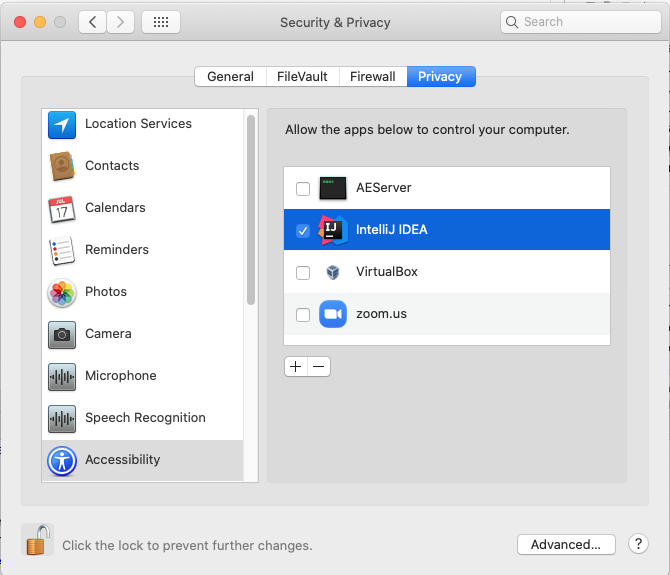

Семинар 9
--

# Тестирование пользовательского интерфейса: настольные приложения.

### Слайды

* [PDF](Seminar09.pdf)
* [PPTX](Seminar09.pptx)

### Видео

* [Часть 1](TODO)
* [Часть 2](TODO)

### Пример

Проект с примерами GUI-тестов на фреймворке [AssertJ](
https://joel-costigliola.github.io/assertj/assertj-swing.html) находится [здесь](
https://github.com/andrewt0301/qa-testing-course/tree/master/seminars/seminar09/example/calculator).

Требуется использовать JDK 8. У более поздних версий могут быть проблемы с совместимостью
(к сожалению разработчики AssertJ не успевают за эволюцией Java).

Для запуска тестов под MacOS необходимо разрешить IntelliJ IDEA управлять компьютером: 

### Домашнее задание

__Срок сдачи без [штрафа](../../grading.md): ??.??.2020__

#### Задание

* Используя фреймворк [AssertJ](https://joel-costigliola.github.io/assertj/assertj-swing.html),
  разработать GUI-тесты для приложения [Calculator](
  https://github.com/andrewt0301/qa-testing-course/blob/master/seminars/seminar09/example/calculator/src/main/java/ru/hse/Calculator.java)
  на JUnit (заготовка [здесь](https://github.com/andrewt0301/qa-testing-course/blob/master/seminars/seminar09/example/calculator/src/test/java/ru/hse/CalculatorJUnitTest.java))
  или TestNG (заготовка [здесь](https://github.com/andrewt0301/qa-testing-course/blob/master/seminars/seminar09/example/calculator/src/test/java/ru/hse/CalculatorTestNGTest.java)).
* Тесты должны обеспечивать полное покрытие кода (JaCoCo) и демонстрировать ошибку в реализации.
* Оценить тестабельность приложения. Кратко описать проблемы, которые возникли при разработке
  тестов и которые могут возникнуть в будущем из-за изменений в GUI приложения.
  Кратко 2-5 предложений.
* Изменять код приложения Calculator для улучшения тестабельности не разрешается.

Проект с приложением Calculator и заготовками для тестов находится [здесь](
https://github.com/andrewt0301/qa-testing-course/tree/master/seminars/seminar09/example/calculator).

### Ссылки

#### Литература

Тестирование графического интерфейса:
* [Тестирование графического интерфейса](
  https://en.wikipedia.org/wiki/Graphical_user_interface_testing) (Wikipedia)
* [Инструменты тестирования графического интерфейса](
  https://en.wikipedia.org/wiki/Comparison_of_GUI_testing_tools) (Wikipedia)

Коммерческие инструменты тестирования графического интерфейса:
* [Visual Studio](https://docs.microsoft.com/en-us/visualstudio/test/use-ui-automation-to-test-your-code?view=vs-2017)
* [TestComplete](https://smartbear.com/product/testcomplete/overview/),
  сайт российского R&D [здесь](https://smartbear.ru/company/products/testcomplete.aspx)
* [Ranorex](https://www.ranorex.com/)

Открытая библиотека AssertJ для тестирования Swing-приложений:
* [AssertJ Swing](http://joel-costigliola.github.io/assertj/assertj-swing.html) (GitHub)

Тестирование расширений для IntelliJ IDEA:
* [Юрий Артамонов "Тип􏰀ы автоматического тестировани􏰁я в IntelliJ IDEA"](
  https://github.com/andrewt0301/qa-testing-course/tree/master/related/Yuriy_Artamonov_Testing_IntelliJ_2020_11.pdf)
* [IntelliJ SDK Guide](
  https://jetbrains.org/intellij/sdk/docs/basics/testing_plugins/testing_plugins.html)
* [IntelliJ UI Test Robot](
  https://github.com/JetBrains/intellij-ui-test-robot)
